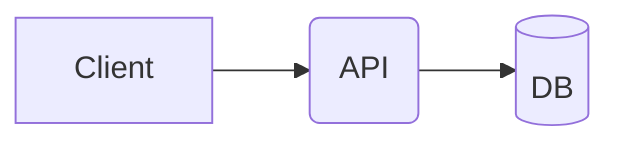
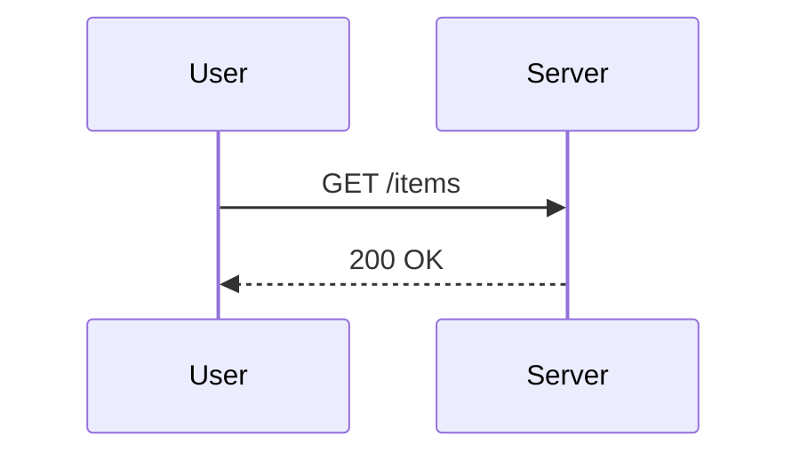
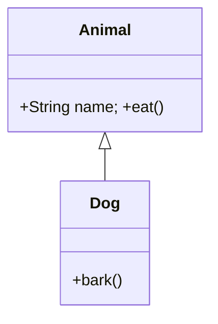
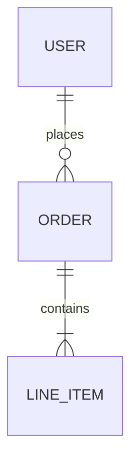
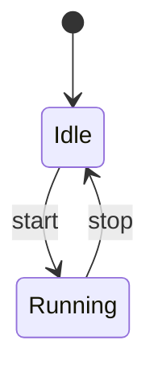
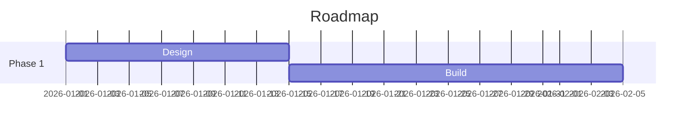
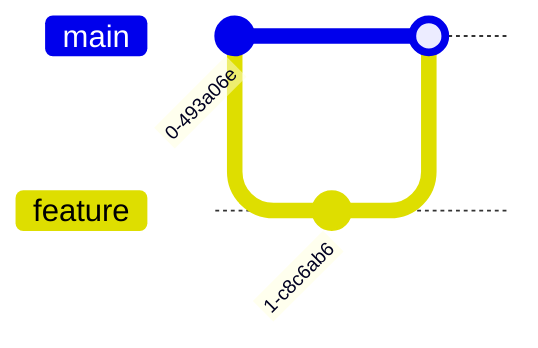
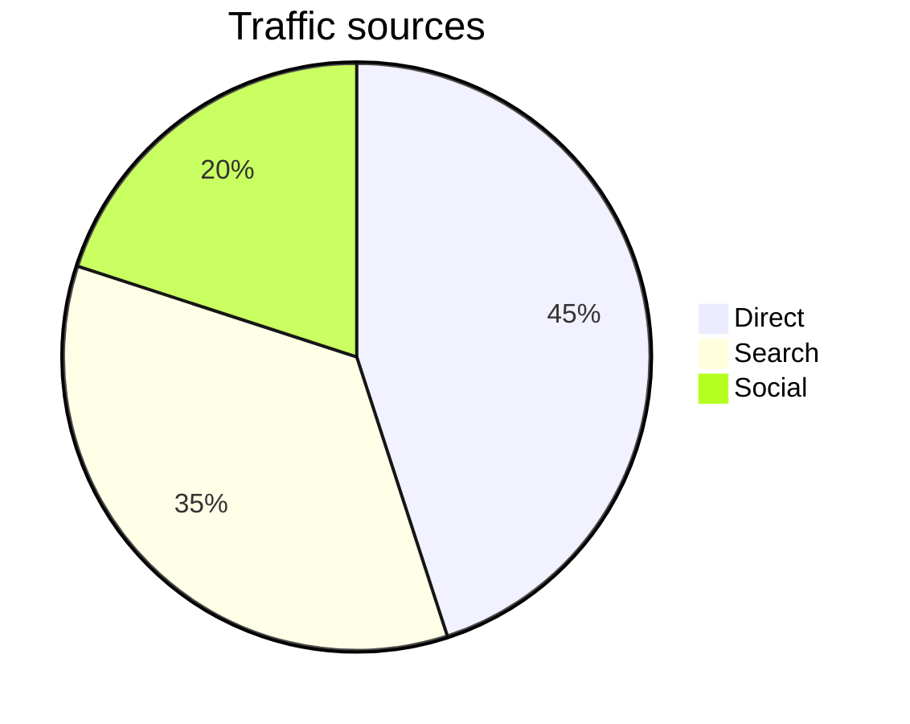
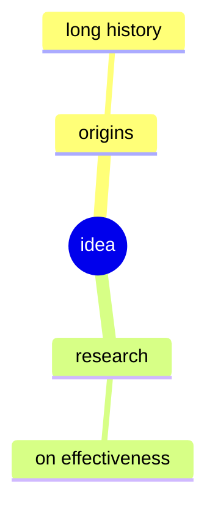
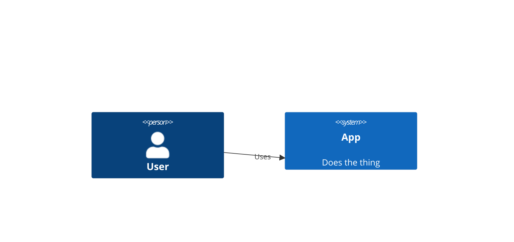

# Mermaid Diagram Skill

Generate mermaid diagrams as `.mmd` source files and render them to SVG, PNG, or PDF using `mmdc` (mermaid-cli). The CLI is invoked on demand through Nix — no install step is required.

## When to use this skill

- The user asks for a mermaid diagram by name, or mentions `mermaid`, `mmdc`, or `.mmd`.
- The user asks for a flowchart, sequence diagram, class diagram, ER diagram, state diagram, gantt chart, git graph, pie chart, mindmap, or C4 diagram, and has not specified a different tool.
- The user wants a diagram embedded in markdown (mermaid is the de-facto format for GitHub/GitLab/many docs sites).

Defer to the `drawio` skill instead when the user explicitly wants a `.drawio` file or output produced by draw.io Desktop.

## Prerequisites

None to install. `mmdc` is fetched on demand via `nix run nixpkgs#mermaid-cli`. The first invocation downloads mermaid-cli and its Chromium dependency from the binary cache (typically 1–3 minutes, a few hundred MB); subsequent runs hit the local Nix store and are fast.

Network access is required on the first run only.

## Quick start

1. Write the diagram source to a `.mmd` file:

   ```mermaid
   flowchart TD
     A[Start] --> B{Decision}
     B -- yes --> C[Do thing]
     B -- no  --> D[Skip]
   ```

2. Render it:

   ```sh
   nix run nixpkgs#mermaid-cli -- -i diagram.mmd -o diagram.svg
   ```

   Note the `--` separator: everything after it is passed to `mmdc`. Without it, Nix tries to interpret the flags itself.

## Rendering: SVG / PNG / PDF

`mmdc` picks the output format from the file extension of `-o`.

```sh
# SVG (preferred for docs and the web — scalable, small)
nix run nixpkgs#mermaid-cli -- -i diagram.mmd -o diagram.svg

# PNG (good for chat, slides; specify width for sharpness)
nix run nixpkgs#mermaid-cli -- -i diagram.mmd -o diagram.png -w 1600

# PDF (good for print)
nix run nixpkgs#mermaid-cli -- -i diagram.mmd -o diagram.pdf
```

Useful flags:

- `-w <px>` / `-H <px>` — output width / height (raster formats).
- `-b <color>` — background, e.g. `-b transparent` or `-b "#ffffff"`.
- `-s <scale>` — output scale factor (1–3).
- `-q` / `--quiet` — suppress progress output.

## Theming and config

```sh
# Built-in themes: default, dark, forest, neutral
nix run nixpkgs#mermaid-cli -- -i diagram.mmd -o diagram.svg -t dark

# Custom mermaid config (JSON)
nix run nixpkgs#mermaid-cli -- -i diagram.mmd -o diagram.svg --configFile mermaid-config.json

# Custom CSS for SVG output
nix run nixpkgs#mermaid-cli -- -i diagram.mmd -o diagram.svg --cssFile diagram.css
```

`-p puppeteer-config.json` is also available for tweaking the headless Chromium launch (e.g. `--no-sandbox` inside containers). Rarely needed on a normal desktop; nixpkgs already wires up the Chromium binary that `mmdc` uses.

## Supported diagram types

A minimal example per type. Save any of these into a `.mmd` file and render with the commands above.

**Flowchart** (prefer `flowchart` over the legacy `graph` keyword):



**Sequence diagram:**



**Class diagram:**



**ER diagram:**



**State diagram:**



**Gantt chart:**



**Git graph:**



**Pie chart:**



**Mindmap:**



**C4 diagram:**



## Best practices

- Keep the `.mmd` source committed alongside the rendered artifact. The source is the source of truth; treat the SVG/PNG/PDF as a build output.
- Prefer SVG for docs/web (scales cleanly, tiny file) and PDF for print. Use PNG only when SVG isn't supported by the target.
- Use the modern `flowchart` keyword over legacy `graph`. They look similar but `flowchart` gets new features.
- Quote labels that contain special characters: `A["Label with (parens) and / slashes"]`.
- Validate by rendering before committing. Mermaid parse errors are clearer from `mmdc` than from the GitHub renderer.
- For embedded usage on GitHub/GitLab, you can drop the `.mmd` body into a ```` ```mermaid ```` fenced block — no rendering needed. Use `mmdc` when you need a standalone file.

## Troubleshooting

- **First run is slow / appears to hang.** It's downloading mermaid-cli plus Chromium from the Nix cache. Wait it out; subsequent runs are instant.
- **`nix run` errors with "command not found" or registry issues.** Confirm flakes are enabled (this dotfiles repo already does so). `nix run nixpkgs#hello` is a good independent sanity check.
- **Offline failure.** `nix run` needs network on the first invocation. Once realised, the package stays in `/nix/store` until garbage-collected.
- **Render hangs or fails with a Chromium error.** Re-run with `--quiet` removed to see full stderr. In a sandboxed environment, supply a `puppeteer-config.json` with `{"args":["--no-sandbox"]}` and pass it via `-p`.
- **Flags being eaten by Nix instead of `mmdc`.** You forgot the `--` separator. Everything before `--` is for `nix run`; everything after is for `mmdc`.
